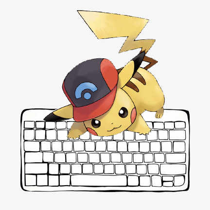

<!-- PROJECT LOGO -->
<br />
<p align="center">
  <a href="https://github.com/CS-Pikachu/Bug-Buddy">
<<<<<<< HEAD
    
=======
    
>>>>>>> dev
  </a>

  <h3 align="center">README</h3><br />

  <p align="center">
  <!--  -->
  
  
  
  
  
   
</p>

  <p align="center">
    <h1></h1>
    <h1 align="center">Bug Buddy</h1>
    <p align="center">
A bug logger for your Developer Team.

  <br />
    <!-- <a href="#">Homepage →</a><br> -->
    <!-- <a href="#">Product Hunt Page →</a> -->
</p>

<br />
<!-- TABLE OF CONTENTS -->
<details open="open">
  <summary>Table of Contents</summary>
  <ol>
    <li>
      <a href="#about-the-project" >About The Project</a>
      <ul>
        <li><a href="#built-with" >Built With</a></li>
      </ul>
    </li>
    <li>
      <a href="#getting-started" >Getting Started</a>
      <ul>
        <li><a href="#prerequisites" >Prerequisites</a></li>
      </ul>
    </li>
    <li><a href="#usage" >Using the App</a></li>
       <!--  <li>
      <a href="#user-manual" >User Manual</a>
      <ul>
        <li><a href="#relay-proper" >Relay Proper</a></li>
        <li><a href="#peach-mode" >Peach Mode</a></li>
      </ul>
    </li>
    <li><a href="#downloadable-app" >Downloadable App</a></li>
    <li><a href="#license" >License</a></li>
<li><a href="#contact" >Contact</a></li> -->
    <li><a href="#acknowledgements" >Acknowledgements</a></li>
  </ol>
</details>

<br />

<!-- ABOUT THE PROJECT -->
## About The Project

Peach QE is the first Relay visualizer to handle all your GraphQL queries under one roof, directly on your desktop.
Upload pre-written queries, live-edit the queries you want to explore, edit variable inputs, and even handle as many databases as required.

<br />

### Built With


* [React](https://reactjs.org/)
* [Redux](https://redux.js.org/)
* [Express](https://expressjs.com/)
* [NodeJS](https://nodejs.dev/)
* [Webpack](https://webpack.js.org/)
* [Jest](https://jestjs.io/)
* [Passport](http://www.passportjs.org/)


<br />

<!-- GETTING STARTED -->
## Getting Started

* Fork and Clone the Repo:

   ```sh
   git clone https://github.com/CS-Pikachu/Bug-Buddy.git
   ```

<br />

### Prerequisites

Install the dpendencies:

* [ npm i ]

  ```sh
  npm install
  ```
* Run the App locally

  ```sh
  npm run dev
  ```

<br />

<!-- USAGE EXAMPLES -->
## Usage

1. Your app will run on your preferred browser on this URL:

   ```sh
   http://localhost:8080
   ```

<h1></h1>
<h3 align="center" >
Enjoy!
</h3>

<br />
<br />

<!-- LICENSE -->
## License

Distributed under the [MIT](https://github.com/CS-Pikachu/Bug-Buddy/LICENSE) License. See [`LICENSE`](https://github.com/CS-Pikachu/Bug-Buddy/LICENSE) for more information.

<br />
<br />
<br />

<!-- ACKNOWLEDGEMENTS -->
## <spam style="color:#ffbf00">Acknowledgements to the Pikachu team:</spam>

* [Jin Qin](https://github.com/devjq)
* [Erik Matevosian](https://github.com/erik-matevosyan)
* [Chris Salisbury](https://github.com/nonstdout)
* [Carlos Botero-Vargas](https://github.com/Carlos-BoteroVargas)

<br />

-------------

<h1 align="center">
THANK YOU!
</h1>